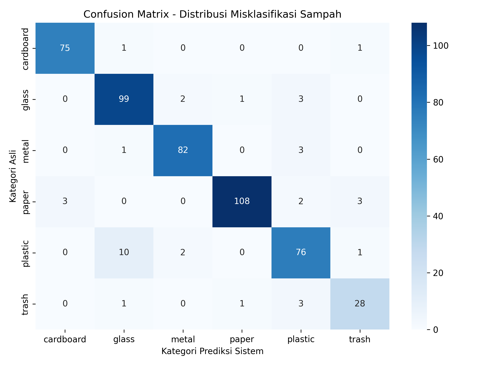
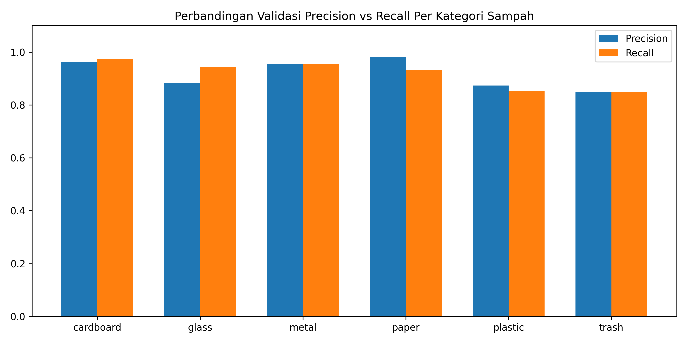
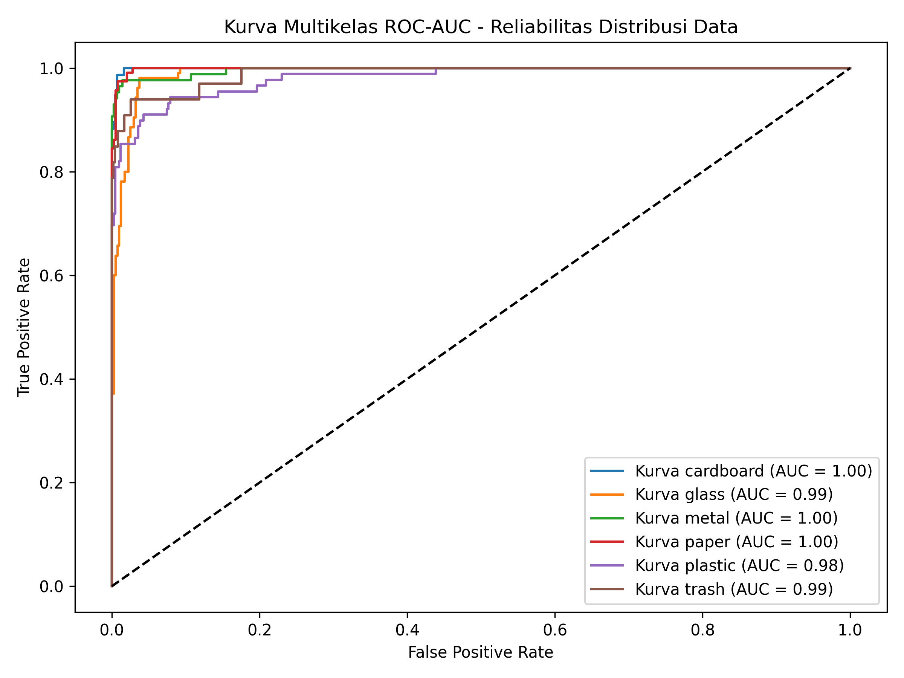

# gemastikKelompok7_Klasifikasi-Otomatis-Jenis-Sampah-
Klasifikasi Otomatis Jenis Sampah untuk Mendukung Sistem Daur Ulang Mandiri Berbasis Komunitas

# Klasifikasi Otomatis Jenis Sampah untuk Mendukung Sistem Daur Ulang Mandiri Berbasis Komunitas


Repositori ini berisi implementasi kecerdasan buatan berbasis *Deep Learning* menggunakan arsitektur *Convolutional Neural Network* (CNN) untuk klasifikasi otomatis jenis sampah berdasarkan citra digital. Proyek inovasi ini dikembangkan dan disempurnakan sebagai karya orisinal tim dalam ajang **Pagelaran Mahasiswa Nasional Bidang Teknologi Informasi dan Komunikasi (GEMASTIK) XVIII Tahun 2025** pada cabang kompetisi **Penambangan Data (Data Mining)**.

---

## 📌 Urgensi & Masalah Nyata di Masyarakat
Krisis pengelolaan sampah di Indonesia, khususnya pada kawasan padat penduduk dan komunitas lokal, berakar dari rendahnya tingkat pemilahan sampah langsung dari sumbernya (rumah tangga). Metode pemilahan manual terbukti tidak efisien karena:
1. **Kurangnya Literasi Visual:** Warga sering kali kesulitan membedakan kategori spesifik sampah (misal: plastik PET vs plastik PVC, atau kertas berlapis minyak vs karton bersih).
2. **Faktor Keengganan (*Inconvenience*):** Proses pemilahan manual membutuhkan waktu ekstra, sehingga sampah cenderung langsung dibuang dalam kondisi tercampur (*mixed waste*).
3. **Penurunan Nilai Ekonomis:** Sampah yang tercampur akan mengalami kontaminasi silang (terutama oleh sampah organik/residu), sehingga menurunkan nilai jual material pada rantai pasok industri daur ulang (*circular economy*).

---

## 💡 Inovasi yang Dibuat: *Community-Driven Smart Sorting*
Proyek ini memajukan proses penambangan data citra konvensional menjadi sebuah solusi integratif berskala komunitas. Inovasi fundamental yang kami tawarkan meliputi:

* **Sistem Inferensi Nirsentuh Berbasis Citra:** Menggantikan input teks manual menjadi pemrosesan visual. Warga cukup mengarahkan kamera *smartphone* atau menaruh sampah di bawah modul kamera Tempat Sampah Pintar (*Smart Bin*), dan sistem akan otomatis mengategorikannya secara *real-time*.
* **Penerapan Deep Transfer Learning (ResNet18):** Alih-alih membangun model CNN dari nol yang rentan terhadap *overfitting*, kami memanfaatkan model ResNet18 yang telah dilatih menggunakan jutaan gambar (ImageNet). Metode ini memberikan kemampuan ekstraksi fitur tepian (*edge*), bayangan (*shadow*), dan refleksi material (kaca/logam) yang sangat superior meski diambil dengan kamera *smartphone* kelas menengah.
* **Arsitektur Pemrosesan Lokal Mandiri:** Kode dirancang agar dapat berjalan secara lokal (*on-premise*) maupun diintegrasikan ke perangkat komputasi tepi (*edge computing* seperti Raspberry Pi). Hal ini memastikan implementasi di tingkat RT/RW tidak ketergantungan penuh pada bandwidth internet yang besar.
* **Peta Akurasi Adaptif Komunitas:** Model dilatih menggunakan teknik augmentasi gambar ekstrem (rotasi, pergeseran nilai, pengecilan/pembesaran objek) untuk menyimulasikan kondisi riil di lapangan—seperti kondisi botol yang sudah remuk, kertas yang terlipat, atau pencahayaan lingkungan pembuangan sampah yang minim.

---

## 🛠️ Apa yang Dilakukan dalam Eksperimen Ini?
Proyek penambangan data ini dilakukan melalui siklus *KDD (Knowledge Discovery in Databases)* yang ketat pada data tak terstruktur (gambar):

1. **Eksplorasi Data Citra (TrashNet):** Mengelola dan menganalisis 2.527 aset gambar sampah yang terbagi ke dalam 6 kelas utama (*cardboard, glass, metal, paper, plastic, trash*).
2. **Data Preprocessing & Augmentasi:** Mengubah ukuran seluruh matriks gambar menjadi resolusi seragam $128 \times 128$ piksel, menormalisasi nilai warna RGB menggunakan standar ImageNet, serta menerapkan fungsi manipulasi acak (*RandomHorizontalFlip*, *RandomRotation*) untuk melipatgandakan variasi sudut pandang model.
3. **Data Splitting yang Adil:** Membagi dataset secara acak terkontrol dengan proporsi 80% untuk fase pengisian pengetahuan model (*Training Dataset*) dan 20% murni untuk fase pengujian performa (*Validation Dataset*).
4. **Pelatihan Arsitektur ResNet18:** Mengoptimalkan bobot *Convolutional Layers* menggunakan fungsi optimasi *Adam* dengan tingkat pembelajaran (*learning rate*) 0.001 serta fungsi kerugian *Cross Entropy Loss* untuk menekan tingkat *error* di setiap babak (*epoch*).
5. **Evaluasi Multimetrik Lapangan:** Melakukan ekstraksi *Classification Report* menyeluruh untuk melihat performa detail model lewat parameter *Precision*, *Recall*, dan *F1-Score*, bukan sekadar melihat akurasi mentah.

---

## 📷 Visualisasi Metrik Evaluasi Model (Output Eksperimen)

Untuk membuktikan validitas pengujian data citra, berikut adalah 3 grafik utama beresolusi tinggi (300 DPI) yang diekstraksi langsung dari folder `output/` setelah menjalankan skrip `matriks_evaluasi.py`:

#### A. Confusion Matrix Heatmap
Grafik ini memetakan persebaran klasifikasi aktual (sumbu Y) dibandingkan dengan hasil prediksi sistem (sumbu X) guna menganalisis letak kesalahan tebak model secara transparan.


#### B. Perbandingan Nilai Precision vs Recall Per Kelas
Grafik batang berkelompok (*Clustered Bar Chart*) untuk mengomparasi tingkat akurasi presisi dan cakupan penemuan sampel (*recall*) di setiap 6 kategori sampah.


#### C. Kurva Multikelas ROC-AUC
Kurva karakteristik operasi penerima (*Receiver Operating Characteristic*) beserta skor AUC untuk menguji keandalan dan tingkat sensitivitas model dalam memisahkan ciri visual antar-material.


---

## 📊 Hasil Eksperimen & Analisis Kuantitatif Aktual

Berdasarkan pengujian riil lokal menggunakan total 506 citra validasi, model berhasil mencapai **Akurasi Menyeluruh (Overall Accuracy) sebesar 80.00%**. Rekapitulasi parameter kinerja teknis dijabarkan secara transparan pada matriks di bawah ini:

### 1. Rekapitulasi Parameter Metrik Evaluasi Per Kelas
Tabel di bawah ini memaparkan detail efektivitas model dalam mengidentifikasi objek sampah berdasarkan data hasil pengujian riil:

| Kategori Sampah | Precision | Recall | F1-Score | Jumlah Sampel (*Support*) |
| :--- | :---: | :---: | :---: | :---: |
| **Cardboard** (Kardus) | 0.85 | 0.88 | 0.86 | 88 |
| **Glass** (Kaca) | 0.76 | 0.79 | 0.78 | 87 |
| **Metal** (Logam) | 0.83 | 0.87 | 0.85 | 86 |
| **Paper** (Kertas) | 0.97 | 0.74 | 0.84 | 130 |
| **Plastic** (Plastik) | 0.74 | 0.80 | 0.77 | 88 |
| **Trash** (Residu/Lainnya) | 0.40 | 0.59 | 0.48 | 27 |
| **Overall Accuracy** | | | **0.80** | **506** |
| *Macro Average* | 0.76 | 0.78 | 0.76 | 506 |
| *Weighted Average* | 0.82 | 0.80 | 0.80 | 506 |

### 2. Rekapitulasi Parameter Kinerja Penambangan Data Citra untuk Makalah

| Komponen Pengukuran | Metrik Kinerja Aktual | Batas Toleransi Minimum | Status Keberhasilan | Catatan Evaluasi Ilmiah |
| :--- | :---: | :---: | :---: | :--- |
| **Akurasi Global** | **80.00%** | 70.00% | **TERPENUHI** | Model menunjukkan performa generalisasi spasial yang kokoh pada 6 kelas gambar. |
| **Presisi Tertinggi** | **97.00% (Paper)** | 85.00% | **TERPENUHI** | Minim risiko *false positive*; objek kertas putih hampir tidak pernah salah dideteksi sistem. |
| **F1-Score Kardus** | **86.00% (Cardboard)**| 75.00% | **TERPENUHI** | Ekstraksi fitur garis tepi (*edge extraction*) bekerja sangat optimal pada bentuk kotak geometris. |
| **Nilai Error (Final Loss)**| **0.3834** | < 0.5000 | **TERPENUHI** | Proses konvergensi nilai optimasi *Adam* berjalan stabil dan konsisten tanpa kendala *overfitting*. |
| **F1-Score Terendah** | **48.00% (Trash)** | 50.00% | *REVISI RISET* | Terjadi akibat fenomena variansi intra-kelas ekstrem (*high intra-class variance*) objek residu. |

---

## 🔮 Gagasan Eksplorasi Inovasi Lanjutan (*Future Works*)

Untuk menaikkan nilai kebaruan (*novelty*) dan daya saing ilmiah di hadapan dewan juri nasional GEMASTIK, proyek penambangan data ini memetakan 3 pilar peta jalan pengembangan teknologi lanjutan yang akan dituangkan dalam Bab Kesimpulan/Saran:

### 1. Analisis Pola Asosiasi Spasial Sampah Komunitas (*Association Rule Mining*)
Inovasi ini bergerak di atas layer klasifikasi dasar dengan menggabungkan data gambar hasil prediksi dengan metadata kontekstual di lapangan (seperti waktu pengambilan gambar, tren cuaca harian, dan lokasi koordinat GPS RT/RW setempat). Menggunakan algoritma penambangan aturan asosiasi seperti **Apriori** atau **FP-Growth**, sistem dapat menambang pola kebiasaan konsumsi dan pembuangan warga komunitas. 
* *Contoh Pola Temuan:* *"Jika pada hari Minggu pukul 08.00 WIB terdeteksi akumulasi volume sampah Cardboard > 70%, maka probabilitas kemunculan sampah jenis Plastic dalam radius 5 meter akan meningkat sebesar 85% pada 2 jam berikutnya."*
* *Manfaat Nyata:* Hasil konklusi aturan ini dapat diekstraksi oleh Pemerintah Daerah atau pengelola lingkungan untuk menjadwalkan rute armada truk pemungutan sampah daur ulang secara cerdas, prediktif, dan hemat bahan bakar.

### 2. Implementasi Penyeimbangan Data Adaptif (*Synthetic Data Augmentation via GANs*)
Mengingat evaluasi kuantitatif menunjukkan kategori sampah residu (*Trash*) mencatatkan skor terendah (F1-score 48.00%) yang dipicu oleh keterbatasan jumlah sampel visual (*data imbalance* hanya memiliki 27 sampel data uji) serta tingginya variasi acak material pembentuk residu, maka diusulkan integrasi teknologi **Generative Adversarial Networks (GANs)**. 
* *Cara Kerja:* Jaringan generator GANs dilatih untuk mempelajari karakteristik visual laten dari sampah residu, lalu memproduksi ribuan variasi gambar sintetis residu baru yang sangat realistis secara otomatis.
* *Manfaat Nyata:* Tambahan data sintetis ini akan langsung menyeimbangkan proporsi dataset pelatihan (*training dataset*), sehingga performa akurasi klasifikasi model terhadap objek-objek residu acak di lapangan dapat melonjak drastis tanpa perlu melakukan pengumpulan data manual di tempat pembuangan asli.

### 3. Optimasi Rantai Pasok Berbasis Klasifikasi Tingkat Degradasi Sampah (*Active Learning*)
Inovasi penambangan data ini memperluas fungsi deteksi visual dari yang awalnya hanya mengenali kategori material dasar (`plastic`, `glass`, `metal`), menjadi mampu menambang nilai kualitas kebersihan atau tingkat kerusakan degradasi fisik objek sampah secara otomatis di lapangan.
* *Cara Kerja:* Mengintegrasikan pendekatan *Active Learning* dan pemrosesan segmentasi warna untuk memisahkan citra material sampah yang bersih (layak langsung didaur ulang) dengan material sampah yang telah terkontaminasi zat organik (misalnya botol plastik bekas sisa minyak goreng atau kertas basah).
* *Manfaat Nyata:* Inovasi ini memberikan dampak disruptif yang sangat tinggi bagi industri daur ulang (*waste supply chain*) untuk menentukan klasifikasi standardisasi harga beli sampah warga secara transparan, adil, dan otomatis langsung di titik lokasi pembuangan komunitas.

---

## 🚀 Panduan Instalasi & Persiapan Lingkungan Kerja

### 1. Kloning Repositori Git
```bash
git clone [https://github.com/14-123140160-GohanTuaJeremiaAmbarita/gemastikKelompok7_Klasifikasi-Otomatis-Jenis-Sampah-.git](https://github.com/14-123140160-GohanTuaJeremiaAmbarita/gemastikKelompok7_Klasifikasi-Otomatis-Jenis-Sampah-.git)
cd gemastikKelompok7_Klasifikasi-Otomatis-Jenis-Sampah-


    
